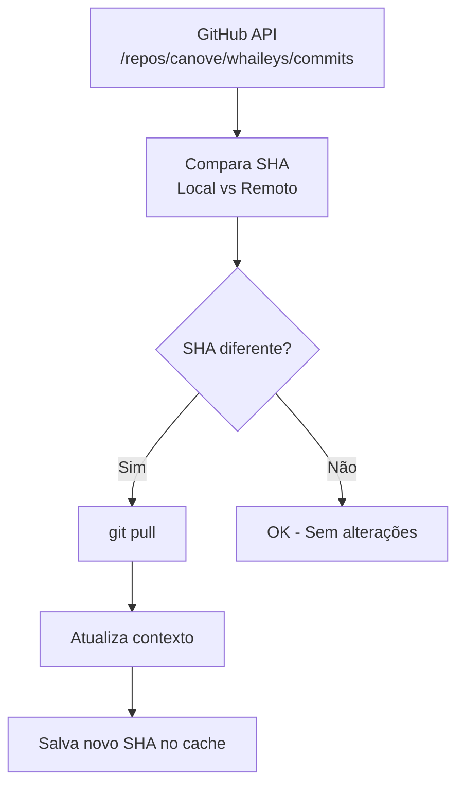

# MCP Whaileys Context

Servidor MCP (Model Context Protocol) para fornecer contexto completo da biblioteca [Whaileys](https://github.com/canove/whaileys) (WhatsApp) ao assistente de IA.

> O repositório whaileys é baixado automaticamente na primeira execução.

## Funcionalidades

Este servidor implementa análise de AST usando **ts-morph** para extrair declarações exportadas, incluindo:

- **Interfaces** - com propriedades, métodos, call signatures e index signatures
- **Type Aliases** - com type parameters e definições completas
- **Enumerations** - com todos os valores
- **Functions** - com parâmetros, tipos de retorno e documentação
- **Classes** - com métodos públicos, propriedades e herança
- **Variables/Constants** - configurações e defaults exportados
- **Namespaces** - estrutura de namespaces exportados
- **Re-exports** - análise de re-exportações entre módulos

## Ferramentas Disponíveis

### Ferramentas Básicas

| Ferramenta | Descrição |
|------------|-----------|
| `whaileys_estrutura` | Lista a estrutura de arquivos do projeto |
| `whaileys_ler_arquivo` | Lê conteúdo de arquivo específico |
| `whaileys_extrair_tipos` | Extrai todas as declarações via AST |
| `whaileys_buscar_tipo` | Busca definição de tipo por nome exato |
| `whaileys_buscar_fuzzy` | Busca com correspondência aproximada |
| `whaileys_listar_exports` | Lista todos os exports agrupados |

### Ferramentas por Categoria

| Ferramenta | Descrição |
|------------|-----------|
| `whaileys_categorias` | Lista declarações de categoria específica |
| `whaileys_interfaces` | Lista todas as interfaces |
| `whaileys_funcoes` | Lista todas as funções |
| `whaileys_enums` | Lista todas as enumerações |
| `whaileys_constantes` | Lista constantes e variáveis |

### Ferramentas de Análise

| Ferramenta | Descrição |
|------------|-----------|
| `whaileys_estatisticas` | Estatísticas detalhadas da biblioteca |
| `whaileys_hierarquia` | Mostra herança (extends/implements) |
| `whaileys_dependencias` | Analisa dependências entre módulos |

### Ferramentas de Auto-Update

| Ferramenta | Descrição |
|------------|-----------|
| `whaileys_check_updates` | Verifica se há atualizações disponíveis no GitHub |
| `whaileys_update` | Atualiza o repositório local para a versão mais recente |
| `whaileys_status` | Mostra status atual do repositório (commits, sincronização) |

## Categorias Suportadas

```
interface   - Interfaces TypeScript
type        - Type Aliases
enum        - Enumerations
function    - Funções exportadas
class       - Classes exportadas
variable    - Constantes e variáveis
namespace   - Namespaces
re-export   - Re-exportações
```

## Instalação

### Opção 1: Via npx (recomendado)

Sem instalação prévia, use diretamente no VSCode:

```json
{
  "servers": {
    "whaileys-context": {
      "type": "stdio",
      "command": "npx",
      "args": ["-y", "mcp-whaileys"]
    }
  }
}
```

### Opção 2: Instalação global

```bash
npm install -g mcp-whaileys
```

```json
{
  "servers": {
    "whaileys-context": {
      "type": "stdio",
      "command": "mcp-whaileys"
    }
  }
}
```

### Opção 3: Repositório local

```bash
git clone https://github.com/SEU_USUARIO/mcp-whaileys.git
cd mcp-whaileys
npm install
npm run build
```

```json
{
  "servers": {
    "whaileys-context": {
      "type": "stdio",
      "command": "node",
      "args": ["d:/caminho/para/mcp-whaileys/dist/index.js"]
    }
  }
}
```

## Onde fica o repositório Whaileys?

Na primeira execução, o MCP baixa automaticamente o repositório para:

- **Windows:** `C:\Users\SEU_USUARIO\.mcp-whaileys\whaileys`
- **Linux/Mac:** `~/.mcp-whaileys/whaileys`

Para usar um caminho personalizado, defina `WHAILEYS_PATH`:

```json
{
  "servers": {
    "whaileys-context": {
      "type": "stdio",
      "command": "npx",
      "args": ["-y", "mcp-whaileys"],
      "env": {
        "WHAILEYS_PATH": "d:/meu/caminho/whaileys/src"
      }
    }
  }
}
```

## Variáveis de Ambiente

| Variável | Descrição | Default |
|----------|-----------|---------|
| `WHAILEYS_PATH` | Caminho para o diretório `src/` do Whaileys | Auto-download em `~/.mcp-whaileys/` |
| `AUTO_UPDATE_ENABLED` | Habilita verificação automática de atualizações | `true` |
| `AUTO_UPDATE_INTERVAL` | Intervalo de verificação em ms | `3600000` (1 hora) |
| `GITHUB_TOKEN` | Token do GitHub para evitar rate limiting | - |

## Exemplos de Configuração

### Configuração mínima (usa auto-download)

```json
{
  "whaileys-context": {
    "type": "stdio",
    "command": "npx",
    "args": ["-y", "mcp-whaileys"]
  }
}
```

### Configuração com path local existente

```json
{
  "whaileys-context": {
    "type": "stdio",
    "command": "node",
    "args": ["/caminho/para/mcp-whaileys/dist/index.js"],
    "env": {
      "WHAILEYS_PATH": "/caminho/para/whaileys/src"
    }
  }
}
```

### Configuração completa

```json
{
  "whaileys-context": {
    "type": "stdio",
    "command": "npx",
    "args": ["-y", "mcp-whaileys"],
    "env": {
      "AUTO_UPDATE_ENABLED": "true",
        "AUTO_UPDATE_INTERVAL": "3600000"
      }
    }
  }
}
```

## Exemplos de Uso

### Extrair todos os tipos do módulo Types

```javascript
whaileys_extrair_tipos({ modulo: "Types" })
```

### Filtrar apenas interfaces do módulo Types

```javascript
whaileys_extrair_tipos({ modulo: "Types", apenas_kind: "interface" })
```

### Buscar tipo específico

```javascript
whaileys_buscar_tipo({ nome: "WAMessage" })
```

### Busca fuzzy quando não sabe o nome exato

```javascript
whaileys_buscar_fuzzy({ query: "message send auth" })
```

### Ver todas as funções do módulo Utils

```javascript
whaileys_funcoes({ modulo: "Utils" })
```

### Listar constantes de configuração

```javascript
whaileys_constantes({ modulo: "Defaults" })
```

### Ver hierarquia de um tipo

```javascript
whaileys_hierarquia({ nome: "BaileysEventEmitter" })
```

### Estatísticas completas da biblioteca

```javascript
whaileys_estatisticas()
```

### Análise de dependências

```javascript
whaileys_dependencias()
```

## Estrutura de Dados

### ExtractedType

```typescript
interface ExtractedType {
  name: string              // Nome da declaração
  kind: ExtractedKind       // Tipo (interface, type, enum, etc.)
  exported: boolean         // Se é exportado
  file: string              // Arquivo fonte
  module: string            // Módulo (Types, Socket, Utils, etc.)
  signature: string         // Assinatura TypeScript
  fullSignature?: string    // Assinatura completa (para types)
  properties?: PropertyInfo[] // Propriedades (interfaces/classes)
  methods?: PropertyInfo[]  // Métodos (interfaces/classes)
  members?: string[]        // Membros (enums/namespaces)
  typeParameters?: TypeParameter[] // Generics
  extends?: string[]        // Herança
  implements?: string[]     // Implementações
  docs?: string             // Documentação JSDoc
  value?: string            // Valor (variáveis)
  lineNumber?: number       // Linha no arquivo
}
```

### PropertyInfo

```typescript
interface PropertyInfo {
  name: string
  type: string
  optional: boolean
  readonly: boolean
  docs?: string
  isMethod: boolean
  isCallSignature: boolean
  isIndexSignature: boolean
  parameters?: string[]
  returnType?: string
}
```

## Estatísticas da Biblioteca

O servidor pode gerar estatísticas detalhadas incluindo:

- **Total de declarações** por categoria
- **Contagem por módulo** (Types, Socket, Utils, etc.)
- **Top interfaces, types e funções**
- **Percentuais de distribuição**

## Recursos Disponíveis

O servidor também expõe recursos via MCP Resources:

| URI | Descrição |
|-----|-----------|
| `whaileys://readme` | README da biblioteca |
| `whaileys://types-index` | Index de tipos exportados |
| `whaileys://statistics` | Estatísticas da biblioteca |

## Tecnologias

- **@modelcontextprotocol/sdk** v1.24.3 - SDK oficial do MCP
- **ts-morph** v27.0.2 - Parser de AST para TypeScript
- **zod** v4.1.13 - Validação de schemas

## Sistema de Auto-Update

O MCP Whaileys possui um sistema integrado de auto-atualização que monitora o repositório oficial `canove/whaileys` no GitHub.

### Como funciona

1. **Na inicialização**: O servidor verifica se há atualizações disponíveis
2. **Periodicamente**: A cada intervalo configurado (default: 1 hora), verifica novos commits
3. **Automaticamente**: Quando detecta uma atualização, executa `git pull` automaticamente
4. **Cache de SHA**: Mantém um registro do último commit verificado para otimizar chamadas à API

### Fluxo de atualização



### Comandos manuais

```javascript
// Verificar se há atualizações (sem aplicar)
whaileys_check_updates()

// Aplicar atualizações disponíveis
whaileys_update()

// Ver status atual do repositório
whaileys_status()
```

### Logs

O servidor emite logs durante o processo de atualização:

```
[INFO] Auto-update habilitado (intervalo: 60 min)
[INFO] Verificando atualizações...
[OK] Atualizado para: ea7f714
      Commit: Merge pull request #56 from canove/develop
```

### Rate Limiting do GitHub

A API do GitHub possui limites de requisições:
- **Sem token**: 60 requests/hora
- **Com token**: 5000 requests/hora

Para ambientes de produção, configure `GITHUB_TOKEN` para evitar rate limiting.
